# 👨🏻‍🤝‍👨🏻Team Project

#### [목차]

🍜[라면모아](#라면모아)

🙋‍♂️[팀원 소개](#%EF%B8%8F팀원-소개)

[프로젝트 환경](#프로젝트-환경)

[기술 스택](#기술-스택)

[DB 설계](#DB-설계)

[프로젝트 수행 역할 및 기능](#프로젝트-수행-역할-및-기능)

[프로젝트 회고](#프로젝트-회고)

# 🍜라면모아

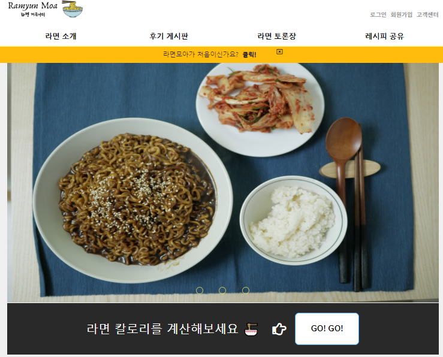

한국의 대표 인스턴트 음식 중 하나는 **라면**이다. 

많은 사람들이 라면을 소비하고, SNS를 통해서 후기를 남기고, 레시피를 공유한다.

필자는 편의점에서 라면을 살 때 포털사이트에서 먹고싶은 라면을 검색한 후에 후기를 보고 결정하는 경우가 많다. 하지만, 포털사이트에서 검색을 하면 직관적이지 않을뿐더러 광고인 경우가 많아서 솔직한 후기를 찾아보기 힘들었다. 

사람들이 **라면후기를 솔직하게 남기고, 레시피도 공유하며, 라면에대한 다양한 의견들도 공유**하면 좋겠다라는 생각에서 탄생한 것이 라면커뮤니티인 "라면모아"이다. 

라면모아 네이밍 뜻은 **모든 라면에 대한 정보들뿐만아니라 사람들도 함께 모여서 의견을 공유하자**는 취지에서 결정하게 되었다.

# 🙋‍♂️팀원 소개

#### 임경원(본인) - 후기 게시판, 라면 토론장 게시판, 레시피 공유 게시판, 팀원들 코드 취합

박흥수 - 라면소개페이지, 게시판관리(관리자), 상품관리(관리자)

이동기 - 회원관련(가입,로그인/아웃, 일반/관리자 권한, 정보 조회, 변경, 탈퇴)

김병연 - 메인페이지, 칼로리계산기, 관리자페이지 레이아웃

주정태 - 관리자 페이지(공지사항, 고객의 소리), 회원 페이지(공지사항, 고객의 소리)

# 프로젝트 환경

- **OS :** Windows

- **IDE :** Eclipse , Version  2019-12 (4.14.0)

- **JDK :** openjdk version "13.0.1"

- **Server :** Apache Tomcat v9.0

- **DB :** MySQL version 5.7

# 기술 스택

- **Programming Language :** java
- **DBMS** : MySQL
- **Front-end** : HTML5 & CSS3, javascript  
- **Back-end**: JSP&Servlet
- **Framework:** Tiles

# DB 설계

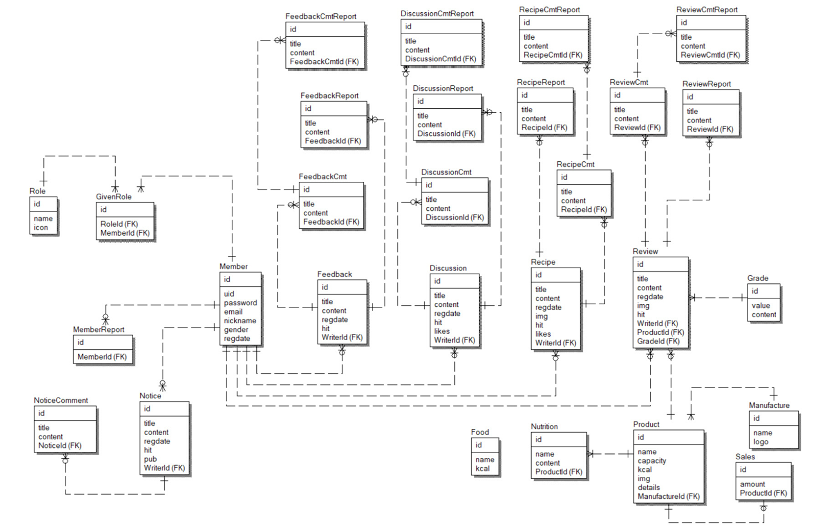

# 프로젝트 수행 역할 및 기능

> ### 후기 , 라면 토론장, 레시피 공유 게시판 UI 구현

- HTML & CSS , Javascript 로 UI,UX 구현

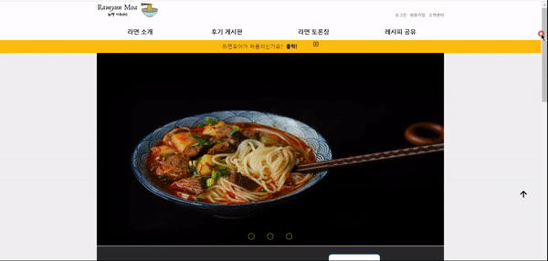

> ### 글 등록 하려면 로그인 필요 기능

- 로그인이 되어있지 않을 때 로그인이 필요하다는 팝업 알림

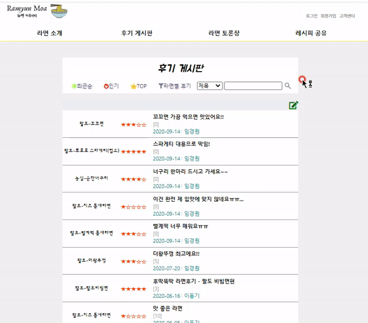

> ### 글 등록

- 로그인 후에 글 등록 가능
  - 로그인 하면 세션(HttpSession)을 활용하여 회원에 대한 아이디를 쿼리로 가져와서 작성자 이름을 유지
  - 아래 예시) 작성자 : 임경원
- 제조사 - 라면 
  - 제조사와 라면의 리스트 양이 방대함으로 고객들이 어떻게 하면 자기가 원하는 라면 이름을 빠르고 쉽게 찾아서 후기를 남길 수 있을까 고민
    - datalist 태그를 활용하여 사용자가 검색하면 해당 리스트 목록이 나오게된다.
- 평점
  - 단순한 별점이나 점수보다는 미리 정해준 코멘트와 별점을 함께 묶음으로 작성자 입장에서 직관적이고 편하게 리뷰 등록 가능
- 직접 구현한 글 에디터 
  - 굵기 , 기울임, 밑줄, 제목1-3 / 본문1-3 글씨 크기 조절 , 이미지 (여러 이미지 복수 선택 가능) 

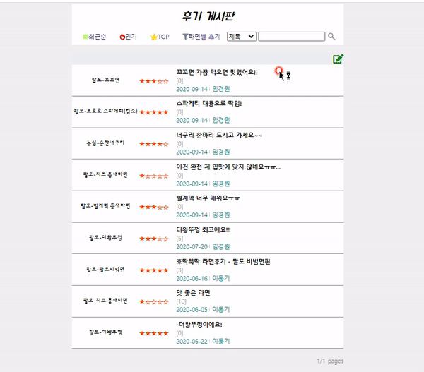

> ### 글 수정

- 글 제목, 제조사-라면 , 평점, 글 수정 가능
- 이미지 크기 또한 수정이 가능한데, 이미지를 클릭해서 직접 원하는 크기를 작성하는 방법으로 구현

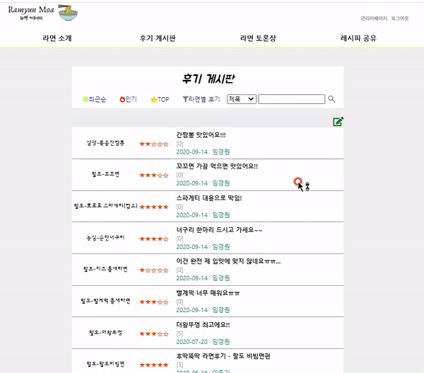

> ### 글 삭제

- 자신이 작성한 글을 삭제

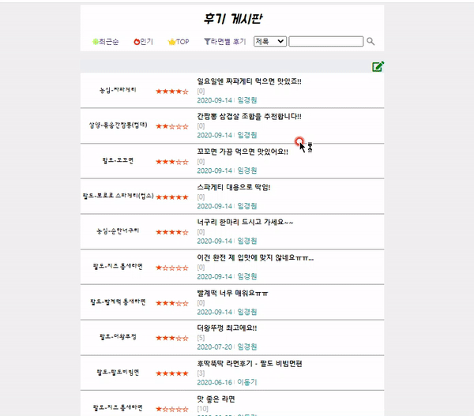

> ### 댓글 등록

- 사용자들에게 더 나은 UX를 제공하기 위해 노력함

  - 댓글 특성상 자신이 작성한 글을 등록하게 되면 새로고침 없이 바로 확인이 가능하도록 비동기 통신인 Ajax 로 구현

- 댓글에 댓글(대댓글) 등록

  - DB 댓글 테이블에서 셀프 조인(Self join)을 사용
    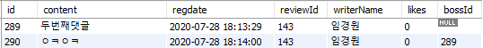

    -> id가 290인 댓글은 bossId가 289니깐 289번 댓글에 달린 댓글임(두 댓글은 reviewId가 143으로 똑같은 게시판 글에 작성된 것임을 나타냄)

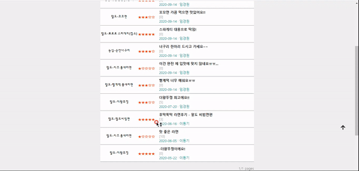

> ### 페이저(pager)

- 한 페이저당 10개씩의 글 목록을 나타냄
  - 예를들어, 11개의 게시글이면 1개의 게시글은 2페이지로 넘어감 

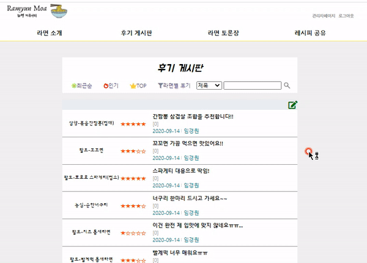

> ### 제목, 작성자, 내용 별로 검색

- 글의 제목, 글의 내용, 글의 작성자로 게시글을 검색할 수 있음

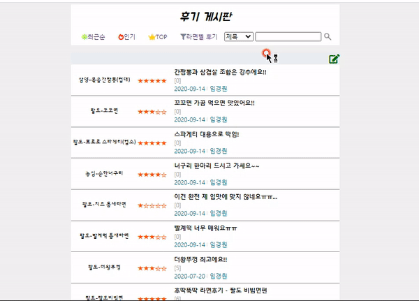

# 프로젝트 회고

### 😮 느낀점

- 의구심
  - 프로젝트를 진행하기 전까지는 내가 웹 사이트를 코딩해서 개발 할 수 있을까? 라는 의구심이 많았음, 장벽이 높아 보였음
- 혼란
  - Back-end 측면에서는 Controller , Service, View 의 요청 순서, 데이터의 흐름을 이해하고 코딩하는데 쉽지 않았음
  - Front-end 측면에서는 경력이 부족하여 HTML&CSS 로 UI를 나의 생각대로 빠르게 구현하지 못하고, javascript는 DOM의 이해가 필요했으며, 동적인 콘텐츠, 비동기 통신에 대한 사용법을 익히는데 많은 시간을 할애함
- 팀, 동료의 중요성
  - 동료끼리의 화합이 너무 좋았음
    -  서로 격려해주면서 어려운 부분이 있으면 같이 해결하려하고, 이해한 부분을 공유하려고 노력함 -> 지치거나, 문제가 풀리지 않아서 답답할 때는 가장 큰 힘이 되는 원동력이 됨
  - 개발 리더를 맡으면서 서로 얼굴 붉히는 일이 생기지 않도록 대화를 많이 시도하고, 고민을 자유롭게 털어놓을 수 있도록 노력함(대화의 중요성 강조)
- 하면 된다! 자신감!
  - 누구는 기초적인 CRUD라고 할지라도, 나에게는 한 땀 한 땀 구현한 코드로 글이 등록, 수정, 삭제되는 기능을 구현했다는 것이 큰 자신감과 성장함을 느낌

### 😢 아쉬운 점

- 완성도
  - 2주라는 한정된 시간에 어떻게든 완성도를 높이려고 했지만, 웹 개발에 입문하는 수준에서는 턱없이 짧은 시간이었음
    - Spring Boot 버전으로 리빌딩 할 예정
    - 클린 코드로 리팩토링 하고 싶은 욕심이 생김
- 시간 분배
  - HTML&CSS 로 UI를 설계하고 구현하는데 시간을 많이 할애함
    - 시각적으로 직접 보이는 개발 파트다보니 디자인적인 측면에 신경을 많이 쓰다가 기능적인 구현에 시간을 많이 쓰지 못함

- 코드 퀄리티
  - 클린 코드 및 코드 퀄리티에 대해 생각하기 보다는 기능들을 구현해보면서 개발에 대한 흥미를 느끼고, 나도 할 수 있다는 자신감을 얻는데 큰 목적이 있었음
  - 클린 코드, 객체지향적인 코드 구현, 유지보수의 용이성을 위한 코드 구현, 팀 동료를 배려하는 코드 작성 등 이제는 코드 한 줄 한 줄 의미있게 작성하는 역량을 키워야 함

[⬆ 위로](#)

