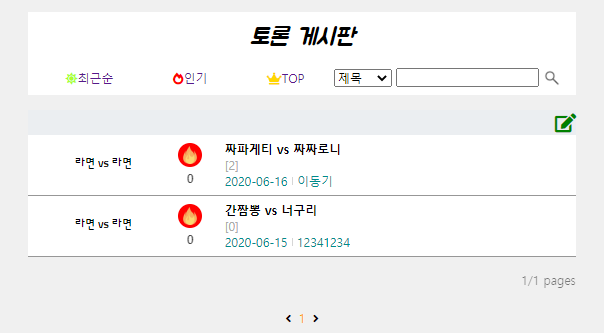

### [Team Project]

# 라면모아

한국의 대표 인스턴트 음식 중 하나는 **라면**이다. 

많은 사람들이 라면을 소비하고, SNS를 통해서 후기를 남기고, 레시피를 공유한다.

필자는 편의점에서 라면을 살 때 포털사이트에서 먹고싶은 라면을 검색한 후에 후기를 보고 결정하는 경우가 많다. 하지만, 포털사이트에서 검색을 하면 직관적이지 않을뿐더러 광고인 경우가 많아서 솔직한 후기를 찾아보기 힘들었다. 

사람들이 **라면후기를 솔직하게 남기고, 레시피도 공유하며, 라면에대한 다양한 의견들도 공유**하면 좋겠다라는 생각에서 탄생한 것이 라면커뮤니티인 "라면모아"이다. 

라면모아 네이밍 뜻은 **모든 라면에 대한 정보들뿐만아니라 사람들도 함께 모여서 의견을 공유하자**는 취지에서 결정하게 되었다.

# 팀원

#### 임경원(본인) - 후기 게시판, 라면 토론장 게시판, 레시피 공유 게시판, 팀원들 코드 취합

박흥수 - 라면소개페이지, 게시판관리(관리자), 상품관리(관리자)

이동기 - 회원관련(가입,로그인/아웃, 일반/관리자 권한, 정보 조회, 변경, 탈퇴)

김병연 - 메인페이지, 칼로리계산기, 관리자페이지 레이아웃

주정태 - 관리자 페이지(공지사항, 고객의 소리), 회원 페이지(공지사항, 고객의 소리)

# 프로젝트 환경

- **OS :** Windows

- **IDE :** Eclipse , Version  2019-12 (4.14.0)

- **JDK :** openjdk version "13.0.1"

- **Server :** Apache Tomcat v9.0

- **DB :** MySQL version 5.7

# 기술 스택

- **Programming Language :** java , javascript , HTML5&CSS3 

- JDBC

- JSP&Servlet
- **framework:** Tiles

# DB 설계

# 프로젝트 수행 역할 및 기능

- 후기 게시판, 라면 토론장, 레시피 공유게시판 UI 구현

  

- 검색 기능 구현 (제목, 작성자, 내용)

- 추후 업데이트

